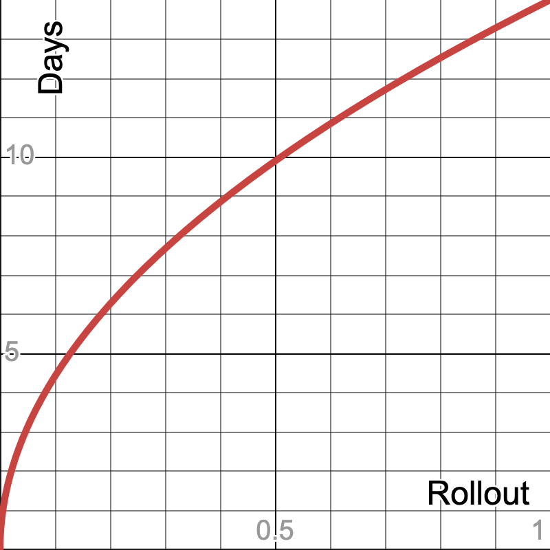

# Dependency cooldowns are unfair; we should use phased rollouts instead

> [!NOTE]
> I'm bad at writing and implicitly make the bold assumption of correlations at 00:00 UTC.
> I've made minor changes from the original draft to emphasise that point.

It was a sunny morning in Melbourne on March 31st. Developers starting their workday were sipping their flat whites as they waited for `npm install` to finish. You know the rest of this story. [The Axios supply chain compromise was live from 00:21 to 03:15 UTC](https://www.sans.org/blog/axios-npm-supply-chain-compromise-malicious-packages-remote-access-trojan) and disproportionately hit the eastern hemisphere. In the aftermath, the quiet calls for dependency cooldowns almost overnight became [industry best practice](https://cooldowns.dev/).

[Cooldowns work against fast-acting supply-chain attacks](https://blog.yossarian.net/2025/11/21/We-should-all-be-using-dependency-cooldowns). But they have an awkward property: they implicitly rely on someone else installing first. In common (mal)practice, that "someone else" means Asia-Pacific:

- 00:00 UTC
- 08:00 in China
- 09:00 in Tokyo
- 11:00 in Sydney

I propose that instead of "everyone waits N days," package managers should deterministically map projects into a rollout window based on stable inputs: a project-specific identifier, package name, version, and artifact digest. The result is a globally distributed adoption curve rather than timezone-based canaries.

If you prefer code to words, [here's a gist that demonstrates the idea](https://gist.github.com/quad/7bf90db449c87e42ec0f52d26ce8c19e).

First, let's consider three other communities that do things differently:

# Antivirus

[In April 2010, McAfee 5958 bricked a whole lot of Windows XP installs](https://krebsonsecurity.com/2010/04/mcafee-false-detection-locks-up-windows-xp/). [The response was phased rollouts](https://www.mcafee.com/support/s/article/000002680), not "everyone wait 24 hours before updating antivirus definitions." They were in a similar situation; the vendors are smart but most of their customers are unsophisticated. Vendors invest in testing and monitoring. And when something goes wrong, vendors are usually the first to find out.

# OS and firmware

[CrowdStrike Falcon crashed 8.5 million computers in one day](https://en.wikipedia.org/wiki/2024_CrowdStrike-related_IT_outages). [Biggest crash in history](https://www.smh.com.au/business/companies/microsoft-outage-across-australia-brings-down-major-businesses-20240719-p5jv2w.html), [front page New York Times, July 20 2024](https://static01.nyt.com/images/2024/07/20/nytfrontpage/scan.pdf).

That update went out at 04:09 UTC, the middle of the business day in Oceania and Asia. [One of the biggest lessons learned was to "release gradually across increasing rings of deployment."](https://homeland.house.gov/wp-content/uploads/2024/09/2024-09-24-HRG-CIP-Testimony-Meyers.pdf) Of course, many of us just felt bad that big enterprises were struck by big enterprise problems. But consider that in 2018, [Windows 1809 was the first update that used a ML-targeted phased rollout](https://blogs.windows.com/windowsexperience/2018/11/13/windows-10-quality-approach-for-a-complex-ecosystem/) after [widespread data loss](https://blogs.windows.com/windowsexperience/2018/10/09/updated-version-of-windows-10-october-2018-update-released-to-windows-insiders/#7RWi4RBxzIgULeMG.97).

# Feature flags

The weirdest part for me as I read all the cooldown buzz was that we don't use cooldowns for our own applications. We deploy to small cohorts, monitor, and then gradually ramp up traffic. The Continuous Delivery community boiled it down to a catchy phrase: [decoupling deployment from release](https://www.thoughtworks.com/radar/techniques/decoupling-deployment-from-release).

# The Proposal

Package registries do have fundamental differences from the above examples:

- OS updates work because the vendor controls publication and distribution  
- Package registries are pull-based; they don't directly decide who gets what artifact  
- Therefore: any phased rollout logic must live on the project-side

The mechanism is simple, each project independently derives a hash from stable inputs:

1. A unique `project_id`
2. The fully qualified `package` name
3. The semver package `version` 
4. The artifact `digest`

The hash is then mapped onto a rollout window; my example code uses `(14 days) * sqrt(h)` so that the release curve is biased toward earlier adoption while still leaving a long tail for detection:

This results in globally distributed and effectively random adoption without any registry coordination. As a worked example, suppose two applications both depend on `axios@1.14.1`. One installs it after 4 hours, another after 5 days, and everyone has it after 14 days. The malicious release spreads through a random global subset first instead of following the sun. The tradeoff is slower convergence on newly published versions, especially for low-download packages. But cooldowns have the same tradeoff; phased rollouts just distribute it more fairly.

It's also important to note that this proposal deliberately changes *when* projects adopt artifacts, not *which* artifacts they resolve. Existing lockfile and reproducibility guarantees remain once a version is selected. And security fixes still warrant different rollout policies.

# What comes next

I thought of ways to overcomplicate this idea. Public attestation logs for canary reports? Cohort-aware tooling? Cross-ecosystem hash conventions? All cool, but I don't want to takeaway from the heroic efforts spent on even better mitigations like:

- Capability sandboxing
- SBOMs
- Runtime monitoring
- Reading diffs

In summary, cooldowns reduce risk, but they don't remove the fact that someone still has to go first. Other parts of the industry learned to use phased rollouts. Package ecosystems should learn the same lesson.
